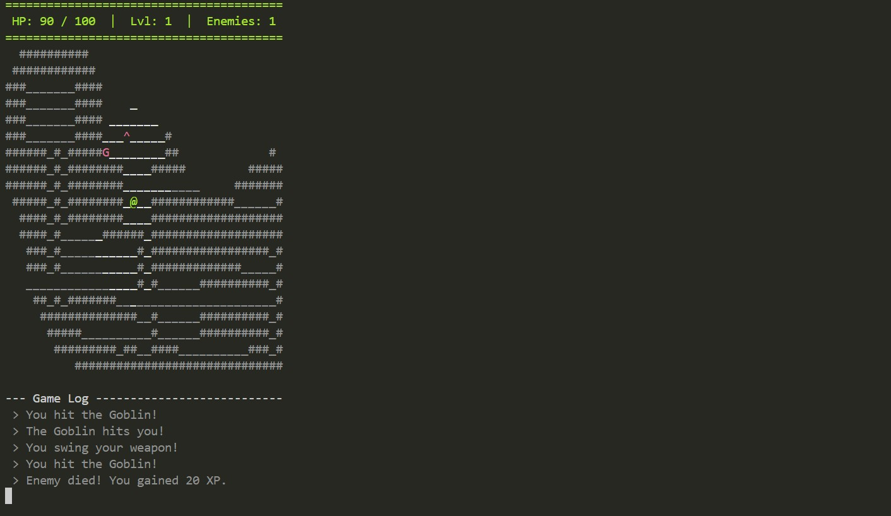

# 🏰 Dungeon Explorer: C++ Console Roguelike

> A text-based dungeon crawler built from scratch in C++ using Object-Oriented Programming principles and the Standard Template Library (STL).


## 📖 Overview
**Dungeon Explorer** is a console-based RPG where the player navigates a procedurally generated dungeon, fights enemies in turn-based combat, and manages resources to survive. 

Unlike simple script-based games, this project demonstrates a robust **Game Engine architecture** separating logic (Entities), data (Map), and presentation (UI). It features dynamic **Fog of War**, **Pathfinding AI**, and **Collision Detection**.



## ✨ Key Features
* **🗺️ Procedural Generation:** Every run creates a unique map with randomized rooms and hallways.
* **🌫️ Fog of War:** Implements a visibility system using Euclidean distance; unvisited areas remain hidden.
* **⚔️ Turn-Based Combat:** Tactical combat system where enemies track and attack the player.
* **🧠 Enemy AI:** Enemies pursue the player when in range and respect collision boundaries.
* **⚠️ Trap System:** Hidden traps that damage the player upon contact.
* **📜 Interactive UI:** Real-time Heads-Up Display (HUD) and a scrolling Message Log for game events.

## 🛠️ Technical Concepts Demonstrated
This project was built to showcase proficiency in **Standard C++** without reliance on heavy game engines.
* **Object-Oriented Programming (OOP):** Usage of **Inheritance** (`Entity` -> `Player`, `Enemy`) and **Polymorphism** for shared behaviors.
* **Memory Management:** Efficient handling of object lifecycles and pointers.
* **STL Containers:** Extensive use of `std::vector` for dynamic entity management and `std::string` for map rendering.
* **Algorithms:** * **Procedural Generation:** Room carving and tunnel connection logic.
    * **Raycasting/Distance:** Logic for the Fog of War system.
* **State Management:** Separation of Game Loop, Update, and Render phases.

## 🚀 Getting Started

### Prerequisites
* A C++ Compiler (GCC/MinGW recommended).
* Windows Terminal or PowerShell (for `conio.h` compatibility).

### Installation & Build
1.  **Clone the repository:**
    ```bash
    git clone [https://github.com/YOUR_USERNAME/Cpp-Roguelike-Dungeon.git](https://github.com/YOUR_USERNAME/Cpp-Roguelike-Dungeon.git)
    cd Cpp-Roguelike-Dungeon
    ```

2.  **Compile the source code:**
    Use `g++` to link all modules together.
    ```bash
    g++ main.cpp Game.cpp Map.cpp Entity.cpp UI.cpp -o DungeonGame
    ```

3.  **Run the game:**
    ```bash
    .\DungeonGame
    ```

## 🎮 Controls
| Key | Action |
| :---: | :--- |
| **W, A, S, D** | Move Up, Left, Down, Right |
| **Spacebar** | Attack adjacent enemy |
| **Q** | Quit Game |

## 📂 Project Structure
The codebase is modularized to ensure separation of concerns:

* **`main.cpp`**: The entry point; initializes the game loop.
* **`Game.cpp/h`**: The Core Engine. Manages the game loop, input handling, and coordinates interactions between objects.
* **`Map.cpp/h`**: Handles dungeon generation, collision checks, and rendering the grid (Walls `#`, Floor `_`).
* **`Entity.cpp/h`**: The base class for all living objects (Health, Coordinates).
    * **`Player.h`**: Derived class with XP and specific stats.
    * **`Enemy.h`**: Derived class with AI movement logic.
* **`UI.cpp/h`**: Handles console output, color codes (`ANSI`), and the message log.

## 🔮 Future Improvements
* [ ] Implement **A* Pathfinding** for smarter enemy movement.
* [ ] Add an **Inventory System** to pick up potions and weapons.
* [ ] Implement **Save/Load** functionality using file serialization.
* [ ] Support for multiple dungeon floors (Stairs).

## 📝 License
This project is open-source and available under the **MIT License**.
